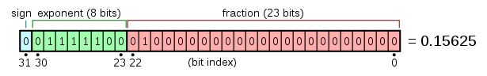

# Fast Inverse Square Root

In computer graphics (video games especially), programs will use inverse square roots to compute angles of incidence, reflection, lighting, and shading. This operation is repeated millions of times to simulate an environment. But this poses a problem; divison and square roots are slow operations at a low level. However, the developers of Quake III Arena (1999) came up with a way to approximate the inverse square root of 32-bit floating point numbers, with an error of at most one percent. Although this algorithm is not used anymore due to technological advances, it is still an interesting algorithm to consider. The following code is the implementation of this algorithm, with the original code and comments included.

```C
float q_rsqrt(float number)
{
  long i;
  float x2, y;
  const float threehalfs = 1.5F;

  x2 = number * 0.5F;
  y  = number;
  i  = * ( long * ) &y;                       // evil floating point bit level hacking
  i  = 0x5f3759df - ( i >> 1 );               // what the fuck?
  y  = * ( float * ) &i;
  y  = y * ( threehalfs - ( x2 * y * y ) );   // 1st iteration
  // y  = y * ( threehalfs - ( x2 * y * y ) );   // 2nd iteration, this can be removed

  return y;
}
```

## IEEE 754

Computers do not simply read and work with numbers like humans do. A computer, in essence, is a really complicated calculator doing operations on 0's and 1's. But we humans are smart enough to develop a system to represent numbers using only 0's and 1's. The standard way is using IEEE 754 notation. The algorithm uses 32-bit floating point numbers, represented in IEEE 754 format. This format uses 1 bit to represnt the sign, 8 digits for the exponent, followed by 23 digits for the mantissa otherwise known as the fraction. For example, supposed we wanted to represent the number 0.15625. The floating point representation is given as:

<p align="center">
  
</p>


To retrieve the value stored in this format:

$$ value = (-1)^{sign} \times 2^{E-127} \times (1 + \sum_{i=1}^{23}b_{23-i}2^{-i} ) $$

In our examplefor 0 01111100 01000000000000000000000, we have:

```math
\begin{align}
value &= (-1)^{0} \times 2^{124-127} \times (1 + 1(2^{-2})) \\
value &= 0.15625
\end{align}
```

However, note that there are special bit patterns that are reserved for certain numbers such as +/- infinity, 0, NaN, etc. 

## Evil Floating Point Bit Level Hacking

Let's look at and try to undertand the line of the code that says:
```C
i  = * ( long * ) &y; 
```
Floating point numbers were never designed for bit manipulation. However, longs were. So our goal here would be to convert whatever floating point value we have stored in `y`, copied to a long, without doing the direct conversion, since the direct conversion and the original number will differ. 

In order to accomplish this, instead of direction converting `y` to a long, we tell C to read the memory address of `y` as a long instead. With this, we are able to store all 32 bits of `y` as a long, stored in another variable `i`. Now, we can apply bit manipulation on this new variable, without the restriction of it being a floating point number. 